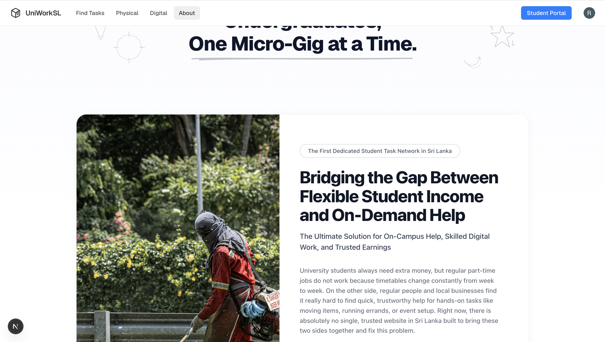

# UniWork Sri Lanka 🚀
### University Students Micro-Gig & Errand Marketplace

**UniWork** is a mobile-first marketplace connecting Sri Lankan state university students with short-term digital and physical tasks. It provides undergraduates with a flexible income stream without the rigid commitment of standard part-time jobs, designed to handle the volatile schedules of local campus life.

---

## 💡 The Market Need (Why State Unis?)

*   **Financial Strain:** Government bursaries (Mahapola) no longer cover the rising cost of living, food, and boarding houses.
*   **Schedule Chaos:** Unpredictable timetables, sudden exam shifts, and strikes make standard shift-based retail or corporate jobs impossible for full-time state undergraduates.
*   **Geographic Density:** Thousands of students live densely packed within a 2km radius of campus gates, making hyper-local physical logistics highly efficient.
*   **Stigma Shift:** Rebrands manual, operational, or service tasks as *"entrepreneurial micro-consulting"* to eliminate the social stigma historically associated with casual labor in Sri Lanka.

---

## 🛡️ Safety & Verification (Critical Core)

Because student safety is paramount, the platform implements a strict multi-layered security protocol:

*   **Strict Onboarding:** Requires a valid `.ac.lk` university email domain or institutional student ID paired with a live facial biometric scan during registration.
*   **Buddy System:** Mandates "Team Gigs" (minimum of 2+ verified students) for physical tasks such as moving furniture or working off-campus locations.
*   **Live Tracking:** Background GPS tracking and automated emergency share links activate instantly the moment a physical gig begins.
*   **Two-Way Ratings:** Blind ratings between posters and students; low platform scores trigger automatic, permanent account bans.

---

## 🛠️ Tech Stack & Architecture
[ Next.js Web App ]       [ React Native Mobile ]
          │                         │
          └───────────┬─────────────┘
                      ▼
                [ API Gateway ]
                      │
                      ▼
           [ FastAPI Backend Engine ]
                      │
     ┌────────────────┼────────────────┐
     ▼                ▼                ▼
[MongoDB]       [PostgreSQL]       [Pinecone]

### Frontend Ecosystem
*   **React Native:** Cross-platform mobile app optimized for low-data footprints, low-tier Android devices, and spotty local cellular connectivity.
*   **Next.js / React:** Fully responsive web application optimized for local desktop browsers used by corporate clients and task posters.

### Backend Infrastructure
*   **FastAPI (Python):** High-performance asynchronous API gateway handling high-concurrency requests and background task workers.
*   **Clerk API:** Secures domain-locked (`.ac.lk`) user sessions and authentication logic across web and mobile layouts.
*   **Redis Pub/Sub & FCM:** Paired with Firebase Cloud Messaging to dispatch immediate task alerts to verified devices within a strict 4km radius.

### Databases & Spatial Engines
*   **MongoDB:** Document store for flexible user/student profile metadata, unstructured skill matrices, high-velocity in-app chat logs, and transient multi-agent conversational states.
*   **PostgreSQL + PostGIS:** Relational data models combined with high-performance geospatial indexing for location calculations.
*   **Pinecone:** High-dimensional semantic vector database for running multi-agent search profiles.
*   **Geofencing & GPS Telemetry:** Real-time spatial tracking engine calculating proof-of-presence, background movement logs, and automated risk-zone telemetry scaling.

### 🧠 Multi-Agent RAG Layer (LangGraph)
Built with **LangGraph** and **Pinecone**, running specialized conversational AI agents:
1.  **Ingestion Agent:** Reads messy, unformatted job descriptions typed naturally by clients, extracts the exact requirements, and uses current market data to calculate a fair, inflation-adjusted price suggestion before publication.
2.  **Sandbox Guards Agent:** Instantly and actively monitors in-app chats to parse and block phone numbers, external payment links, or personal emails, preventing users from bypassing the platform escrow system.

---

## 💰 Monetization: The Hybrid Deposit Premium
> **Platform Promise:** Always 100% free for verified university students.

*   **Digital Tasks (In-App Split):** When a poster scans the dynamic **LankaQR** to pay for a digital task, the app uses a split-payment structure where 95% goes directly to the student's linked account, and 5% is routed to the UniWork corporate bank node as an infrastructure platform fee.
*   **Physical Tasks (The Unlock Token):** For physical tasks where users meet in person, the task remains completely free for the student. The client pays a small flat fee (e.g., 50 LKR to 100 LKR) via bank card (**Stripe**) or LankaQR to "Unlock the Student Buddy Allocation" once they choose their workers. This monetizes upstream from the employer.
*   **Corporate Task Activation:** Premium subscriptions or bulk credits purchased by corporate clients via corporate payment rails to activate large-scale, automated, or high-priority campus errands.
*   **Targeted Student Ads:** Paid banner space for student-focused brands, including local boarding places, food suppliers, telecom providers, and student banking services looking for direct campus reach.

---

## 📋 Supported Gig Ecosystem

The platform cleanly splits incoming operational workflows into two distinct pipelines:

| 💻 Digital Tasks (Remote) | 🏃‍♂️ Physical & Event Logistics (Hyper-Local) |
| :--- | :--- |
| • Social Media Management & Reels/TikTok Editing | • Corporate Event Operations & Hosting |
| • Graphic Design (Flyers, Menus, Social Posts) | • SIM Card Activation & Promotion Drives |
| • Social Media Content Creation | • Boarding House Furniture Shifting & Packing |
| • Basic Web/WordPress Setup & Bug Fixing | • Floral Decoration & Setup |
| • Virtual Assistance, Data Entry & Copy-typing | • On-the-Ground Market Research & Field Surveys |
| • Online Tutoring (O/L, A/L, or Peer-to-Peer) | • Painting, Cleaning & Grass Cutting |
| • Freelance Content Writing | • Photography Assisting & Equipment Setup |

---

## 🔬 Research Mapping: Keeping Students Safe & Stopping Scams

*   **The Research Problem:** Most traditional gig economy applications fail to protect students performing physical, real-world jobs from being scammed, harassed, or unilaterally underpaid by malicious clients who claim work wasn't completed.
*   **The Tech Solution:** UniWork resolves this by utilizing background GPS and Geofencing telemetry. When a student arrives at an assigned job site, the app tracks their physical perimeter locations to generate an un-fakeable, cryptographic **Proof of Presence**.
*   **Catching Liars:** If a client attempts to commit fraud by claiming *"The student never showed up, so I am refusing payment,"* the system runs an automated audit against the background GPS logs. If the telemetry proves the student was on-site for the required duration, the app exposes the client's lie, releases the escrow payment to the student, and instantly bans the client's account.

---

## 🚀 Go-To-Market Strategy

*   **Phase 1: Seed the Supply** – Secure 50-100 digital gigs (data entry, translation, design) from local startups before inviting the general student populace to prevent an empty marketplace.
*   **Phase 2: Grassroots Trust** – Partner directly with official Faculty Student Unions. Frame the app transparently as a student-welfare and financial relief initiative.
*   **Phase 3: Ambassadors** – Pay select final-year students micro-bonuses and credits for onboarding, validating, and peer-reviewing their respective faculties.
*   **Phase 4: Hyper-Local Launch** – Do not launch island-wide initially. Pilot strictly at a single campus cluster (e.g., University of Moratuwa - UoM) using only digital gigs first to test the stability of payment gateways safely.

---

## ⚖️ Legal & Compliance

*   **Financial (CBSL):** Partnering directly with a licensed commercial bank in Sri Lanka (via secure banking APIs like LankaQR) to legally manage and distribute escrow wallet systems without violating Central Bank regulations.
*   **Labor Laws:** Clearly defines students as independent freelancers/contractors in the Terms of Service to insulate the platform and posters from minimum wage, EPF, or ETF statutory liabilities.
*   **Data Privacy (PDPA):** Strictly aligned with the Sri Lankan Personal Data Protection Act. Student IDs are heavily encrypted at rest, and live telemetry locations remain completely hidden until a gig is formally accepted by both parties.